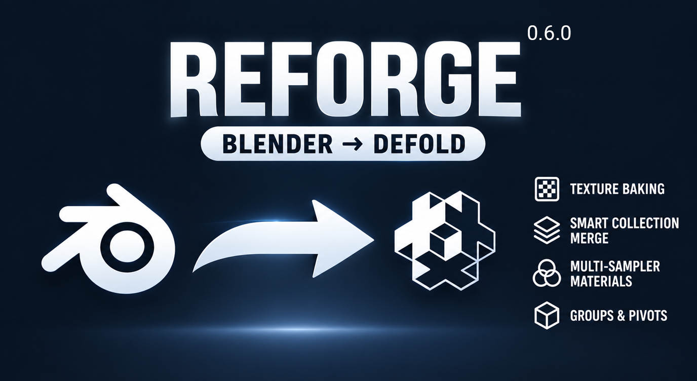

# Reforge - Defold Scene Exporter (Blender Add-on / Extension)

Reforge is an advanced export pipeline connecting **Blender** to the **Defold engine**. It exports entire scenes, prototypes, multi-sampler materials, baked textures, and collision objects directly into your Defold project structure while preserving your manual edits inside the Defold editor.
 
**Author:** Alexander Bulatov

---

## Key Features

- **Scene Export (`.collection`)**: Generates a ready-to-use Defold `.collection` matching Blender transforms.
- **Non-Destructive Workflow**: Re-exporting scenes **preserves** instance `component_properties`, custom `embedded_instances` (scripts, lights, cameras, models), and `collection_instances` configured in Defold.
- **Prototype Assets**: Exports `.glb` meshes, `.model` definitions, and generates `.go` prefabs once (never overwriting custom components or logic).
- **In-Engine Color Texture Baking**: Built-in Cycles EMIT baking for complex materials (Ucupaint, procedural textures, color ramps, vertex colors), with automatic 1x1 solid color fallback for meshes without UVs.
- **Defold Illumination & Multi-Sampler Support**: Native multi-sampler `.model` export with automatic mapping for Astrochili's **Defold Illumination** library (`DIFFUSE_TEXTURE`, `DATA_TEXTURE`, `LIGHT_TEXTURE`, `SPECULAR_TEXTURE`, `NORMAL_TEXTURE` with normal map node traversal).
- **Named Sub-Collections & Group Pivots**: Organize objects into sub-collections with `defold_group` and define custom group pivots with `group_center`.
- **Duplicate Name Detection**: Automatically maps numeric Blender duplicates (`Rock.001`, `Rock.002`) to the base prototype (`Rock`), sharing assets while preserving unique instance placements.
- **Material & Object Overrides**: Configure Defold material/texture paths on materials or override them per object.
- **Dedicated Material UI**: Manage Defold material bindings and bake settings directly from Blender’s Material Properties panel.
- **Convex Collision Export**: Generates `.convexshape` and `.collisionobject` files per prototype.
- **Safe Cleanup**: Quickly remove exporter-created custom properties with confirmation safeguards.

---

## Installation

### Method 1: Blender Extensions (Blender 4.2+) — Recommended

Reforge is packaged as a standard Blender Extension:

1. In Blender, go to **Edit → Preferences → Extensions**.
2. Search for **Reforge**.
3. Click **Install**. Updates are handled automatically through Blender!

### Method 2: Manual Installation from Disk

1. Download the latest `reforge-<version>.zip` from the [Reforge Releases](https://github.com/ufgo/reforge/releases).
2. Open Blender and navigate to:
   - **Blender 4.2+**: **Edit → Preferences → Get Extensions → Install from Disk…** (from top-right dropdown menu).
   - **Blender 4.0 / 3.6**: **Edit → Preferences → Add-ons → Install from Disk…**.
3. Select the downloaded `.zip` file and enable Reforge.

The Reforge panel is located in:
> **3D Viewport → Sidebar (N key) → Reforge**

---

## Quick Start Guide

### 1. Configure Project Folders
In the Reforge sidebar panel:
- Set **Defold Project Root** to your Defold project folder.
- Optionally adjust target subdirectories (defaults to `assets/models`, `assets/prefabs`, `assets/scenes`, `assets/textures`, `assets/collisions`).

### 2. Tag Meshes for Export
Only mesh objects with a `defold_prototype` property are exported. Use the **Tools** section to tag objects in bulk:
- **Set Props (Selected)**, **Set Props (Visible)**, or **Set Props (All)**.
- If **Detect duplicates** is enabled, objects like `Tree.001` and `Tree.002` will automatically receive `defold_prototype = "Tree"`.

### 3. Configure Materials & Baking
Open **Properties → Material tab → Reforge**:
- Set **Defold Material** (e.g. `/assets/materials/model.material` or `/illumination/materials/model.material`).
- Set **Defold Texture** (optional override).
- For procedural shaders, vertex colors, or Ucupaint layers: enable **Bake Color Texture (PNG)** and choose resolution and padding.

### 4. Export
- **Generate Scene (`.collection`)**: Exports all prototype assets (`.glb`, `.model`, `.go`, collisions, baked textures) and generates or updates the Defold `.collection`.
- **Export Selected Prototype (No Scene)**: Quickly refresh assets for only the selected prototype without modifying the scene file.
- **Export All Prototypes (No Scene)**: Refresh all prototype assets without touching the collection.

---

## Feature Details

### 🔄 Non-Destructive Scene Re-exports
A major pain point in export pipelines is losing editor adjustments when re-exporting. Reforge parses your existing Defold `.collection` and safely preserves:
- **Component Properties**: Custom script properties, material uniforms, or tint overrides assigned to instances in Defold.
- **Custom Embedded Instances**: Game objects, lights, cameras, or audio sources added directly inside Defold.
- **Collection Instances**: External sub-collections instantiated inside Defold.
- **`scale_along_z`**: Defold collection setting is retained.

---

### 🎨 In-Engine Color Texture Baking (Cycles EMIT)
When your Blender materials use complex node networks (procedural nodes, color ramps, vertex colors, or the **Ucupaint** add-on), standard glTF exporters cannot export the final appearance.

Reforge provides an automated baking pipeline (`bake.py`):
- **Unlit Emission Bake**: Automatically routes the material's base color into an unlit emission shader for pure albedo capture, with a fallback to Cycles Diffuse Color-only pass.
- **Environment Isolation**: Reforge temporarily switches the engine to Cycles, isolates the active material slot (avoiding "No active image" errors from other slots), bakes, and cleanly restores your original render engine and settings.
- **No-UV Fallback**: Meshes without UV unwrapping but with a constant base color are automatically saved as a lightweight 1x1 solid color PNG.
- **Model Integration**: The resulting `<proto>__<mat>_albedo.png` is automatically bound to the `.model` texture sampler (`DIFFUSE_TEXTURE` or `tex0`).

Configure baking in **Properties → Material → Reforge**:
- **Bake Color Texture (PNG)**: Enable baking for this material.
- **Bake Resolution**: Texture size (512, 1024, 2048, etc., default `1024`).
- **Bake Padding**: Edge dilation margin in pixels (default `8`).

---

### 💡 Multi-Sampler Materials & Defold Illumination
Standard Defold models typically use a single sampler (`tex0`). However, modern 3D rendering pipelines and extensions often require multiple texture samplers per material slot. Reforge introduces full multi-sampler support in `.model` generation and includes out-of-the-box integration with Astrochili's **[Defold Illumination](https://github.com/astrochili/defold-illumination)** forward-shading lighting library.

#### The Problem It Solves
Defold Illumination provides dynamic lighting (sunlight, point lights, spot lights, linear and radial fog) for Defold 3D games. To participate in lighting, models must use `/illumination/materials/model.material`, which expects **exactly 5 texture samplers**:
1. `DIFFUSE_TEXTURE`
2. `DATA_TEXTURE`
3. `LIGHT_TEXTURE`
4. `SPECULAR_TEXTURE`
5. `NORMAL_TEXTURE`

Crucially, **any unused texture slots MUST be explicitly assigned to `/illumination/textures/empty.png`**, and `DATA_TEXTURE` must always point to `/illumination/textures/data.png`. Configuring this by hand for dozens of meshes inside Defold is tedious and prone to missing slots or crashes.

#### Automated Illumination Mapping
Reforge automates this completely. When a material's Defold Material path points to `/illumination/materials/model.material` (or contains `illumination/materials/model.material`):

1. **Automatic Sampler Extraction**:
   - `DIFFUSE_TEXTURE`: Extracted from Principled BSDF **Base Color** / Color image node (or overridden by the baked albedo if baking is enabled).
   - `DATA_TEXTURE`: Automatically assigned to `/illumination/textures/data.png`.
   - `LIGHT_TEXTURE`: Extracted from Principled BSDF **Emission** / Emission Color (fallback: `/illumination/textures/empty.png`).
   - `SPECULAR_TEXTURE`: Extracted from Principled BSDF **Specular**, **Roughness**, or **IOR** (fallback: `/illumination/textures/empty.png`).
   - `NORMAL_TEXTURE`: Extracted from Principled BSDF **Normal**, intelligently traversing through `ShaderNodeNormalMap` nodes to find the connected image texture (fallback: `/illumination/textures/empty.png`).
2. **Safe Fallbacks**: If any optional texture is not connected in Blender, Reforge automatically fills the slot with `/illumination/textures/empty.png`.
3. **Texture Export**: Connected image files are automatically copied/exported to your Defold project’s texture directory (`assets/textures/`).

| Sampler Slot | Blender Shader Node Source | Fallback if Unlinked |
| :--- | :--- | :--- |
| `DIFFUSE_TEXTURE` | Principled BSDF **Base Color** (or baked albedo PNG) | `/builtins/assets/images/logo/logo_256.png` |
| `DATA_TEXTURE` | *Auto-assigned by Reforge* | `/illumination/textures/data.png` |
| `LIGHT_TEXTURE` | Principled BSDF **Emission** (light/emission map) | `/illumination/textures/empty.png` |
| `SPECULAR_TEXTURE`| Principled BSDF **Specular** / Roughness / IOR | `/illumination/textures/empty.png` |
| `NORMAL_TEXTURE` | Principled BSDF **Normal** (traversing `Normal Map`) | `/illumination/textures/empty.png` |

#### Quick Start with Defold Illumination
1. Add the [Defold Illumination dependency](https://github.com/astrochili/defold-illumination/releases) to your Defold `game.project`.
2. In Blender, select your material and open **Properties → Material → Reforge**.
3. Set **Defold Material** to `/illumination/materials/model.material`.
4. In Blender’s Shader Editor, link your diffuse, emission, specular, and normal maps to the Principled BSDF node as usual.
5. Export using **Generate Scene** or **Export Selected Prototype**.
6. In Defold, place `illumination.go` (sunlight/fog) or `light_point.go`/`light_spot.go` in your scene — your exported models will be illuminated immediately!

*(For full details on light sources, fog, and shader constants, see [illumination_README.md](illumination_README.md).)*

For standard materials (non-illumination), Reforge automatically falls back to the classic single `tex0` sampler.

---

### 📁 Sub-Collections & Group Pivots (`defold_group` & `group_center`)
Organize instances hierarchically inside Defold:

- **`defold_group` (string)**: Tag objects with a group name (e.g. `buildings`, `props`, `foliage`).
  - Standard objects without a group are placed under `root -> <prototype> -> instances`.
  - Grouped objects are placed directly under `root -> <group_name> -> instances`.
- **`group_center` / `defold_group_center` (bool)**:
  - Designate an object (an Empty or mesh) as the pivot center for that group.
  - The group embedded instance in Defold receives the world position and rotation of the center object.
  - All child instances in the group are exported with **local transforms relative to the group pivot**, allowing you to move or rotate the entire group in Defold cleanly!

---

### 🎯 Duplicate Name Detection (`detect_duplicates`)
When duplicating objects in Blender (`Shift+D` or `Alt+D`), Blender appends numeric suffixes like `.001`, `.002`.

In the **Tools** panel, enable **Detect duplicates**:
- Objects named `Crate.001`, `Crate.002`, `Crate.003` are automatically assigned `defold_prototype = "Crate"`.
- Only a single set of assets (`Crate.glb`, `Crate.model`, `Crate.go`) is exported.
- All duplicates are placed in the `.collection` with their unique positions, rotations, and scales.

---

### 🛡️ Convex Collision Export
Enable convex collision generation on objects:
- `defold_collision` = `True`
- `collision_group` = `"default"` (or your custom group)
- `collision_mask` = `"default"` (or your custom mask)

Reforge generates:
- `assets/collisions/<proto>.convexshape` (computed from mesh convex hull vertices)
- `assets/collisions/<proto>.collisionobject` (STATIC collision object)
- Links the collision object into the prototype’s `.go` file.

---

### 🎯 GLB Transform Fix (Origin Snapping)
To prevent Blender's glTF exporter from embedding arbitrary world-space translation offsets into prototype `.glb` files, Reforge temporarily snaps each prototype object to the world origin (`(0, 0, 0)`) during GLB export, then immediately restores its transform. This guarantees that Defold instances position the model exactly at their instance coordinates without double-transformation artifacts.

---

## Custom Properties Reference

### Object Properties
| Property | Type | Description |
| :--- | :--- | :--- |
| `defold_prototype` | string | Prototype ID and filename base (e.g. `Rock_01`). Required for export. |
| `defold_group` | string | Name of the sub-collection group in Defold (empty = grouped under prototype). |
| `defold_group_center` | bool | Mark this object as the pivot center for its `defold_group`. |
| `defold_material` | string | *(Optional)* Object-level override for Defold material path. |
| `defold_texture` | string | *(Optional)* Object-level override for Defold texture path. |
| `defold_collision` | bool | Enable convex collision export for this prototype. |
| `collision_group` | string | Collision group name (default: `"default"`). |
| `collision_mask` | string | Collision mask name (default: `"default"`). |

### Material Properties
| Property | Type | Description |
| :--- | :--- | :--- |
| `defold_material` | string | Target Defold `.material` path. |
| `defold_texture` | string | Defold texture path (defaults to Base Color image). |
| `bake_color_texture` | bool | Bake final color to PNG using Cycles EMIT pass. |
| `bake_resolution` | int | Bake image resolution in pixels (default: `1024`). |
| `bake_padding` | int | Edge dilation padding in pixels (default: `8`). |

---

## File Overwrite Behavior

| File Type | Overwrite Policy | Note |
| :--- | :--- | :--- |
| `<proto>.go` | **Never Overwritten** | Preserves scripts, custom components, and manual changes. |
| `<name>.collection` | **Merged & Updated** | Preserves instance component properties, custom embedded instances, and collection instances. |
| `<proto>.glb` | Overwritten | Updated on asset or scene export. |
| `<proto>.model` | Overwritten | Updated on asset or scene export. |
| `<proto>.convexshape` | Overwritten | If `defold_collision` is enabled. |
| `<proto>.collisionobject` | Overwritten | If `defold_collision` is enabled. |
| Textures (`.png`) | Overwritten | Overwritten by filename to prevent `_1`, `_2` duplicate spam. |

---

## Troubleshooting

### "No MESH objects with 'defold_prototype' found"
- Ensure your objects are Mesh datablocks.
- Run **Tools → Set Props (Selected / Visible / All)** to tag your objects.
- If **Export Visible Only** is active, ensure the objects are visible in the viewport.

### Texture baking issues or "No active image" errors
- Reforge automatically isolates the material slot during bake to prevent conflicts.
- Ensure the object is not hidden from render.
- If a mesh lacks UV coordinates, Reforge will output a solid 1x1 PNG if a constant base color is detected. For textured bakes, unwrap your mesh (e.g. `Smart UV Project`).

### Collision offset or unexpected orientation
- Convex hull generation applies object rotation and scale.
- Avoid negative scaling (mirrored objects without applied transforms).
- If transforms are unusual, apply transforms (**Ctrl+A → Apply All Transforms**) in Blender before export.

---

## Changelog

For a detailed file-by-file comparison and migration report between the initial public release (v0.5.1) and the current version, see [changelog.txt](changelog.txt).

---

## License

Reforge is licensed under the **GNU General Public License v3.0 or later** ([GPL-3.0-or-later](https://www.gnu.org/licenses/gpl-3.0.html)).
